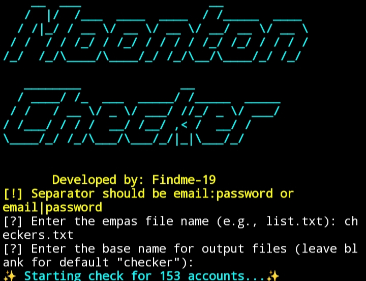
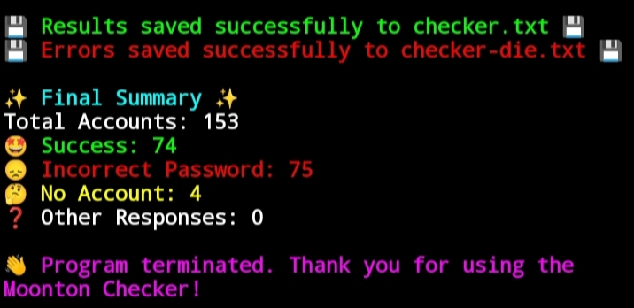

# Moonton Account Checker

A Python tool for verifying Moonton accounts.
## Features

- **Account Verification**: Checks if Moonton account credentials are valid.
- **Detailed Account Status**: Displays account statuses like successful login, incorrect password, or account not found.
- **Save Results**: Exports successful logins.

## Installation

### Prerequisites
- **Python 3.8+**

### Installation Steps
1. Clone this repository:
   ```bash
   git clone https://github.com/findme-19/Moonton-Checker
   ```
2. Navigate into the project directory:
   ```bash
   cd Moonton-Checker
   ```
3. Install the required Python packages:
   ```bash
   pip install -r requirements.txt
   ```

## Usage

1. **Prepare an Account List**: Create a file (e.g., `list.txt`) with accounts in the format `email:password` or `email|password`.  
   Example:
   ```
   user1@example.com:password1
   user2@example.com|password2
   ```

2. **Run the Script**:
   ```bash
   python main.py
   ```

3. **Input the Filename**: When prompted, provide the filename (e.g., `list.txt`), and the script will begin checking accounts.

## Example Output

```plaintext
Moonton Checker
Developed by: Findme-19

🤩 [SUCCESS] - user1@example.com
😞 [ERROR] - Incorrect password for user2@example.com
🤔 [NOT FOUND] - Account does not exist for user3@example.com

✨ Final Summary ✨
Total Accounts: 100
🤩 Success: 30
😞 Incorrect Password: 50
🤔 No Account: 15
❓ Other Responses: 5
```

## Screenshot

### Start Menu


---

### Progress


---

### Output

