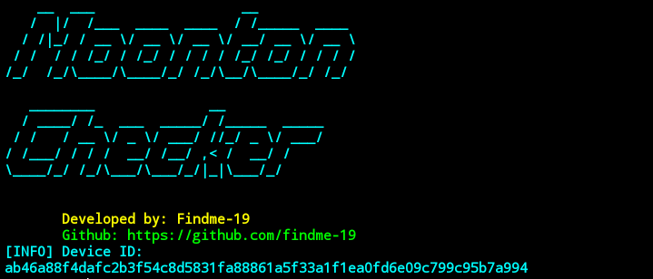
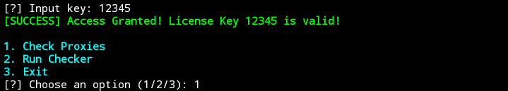
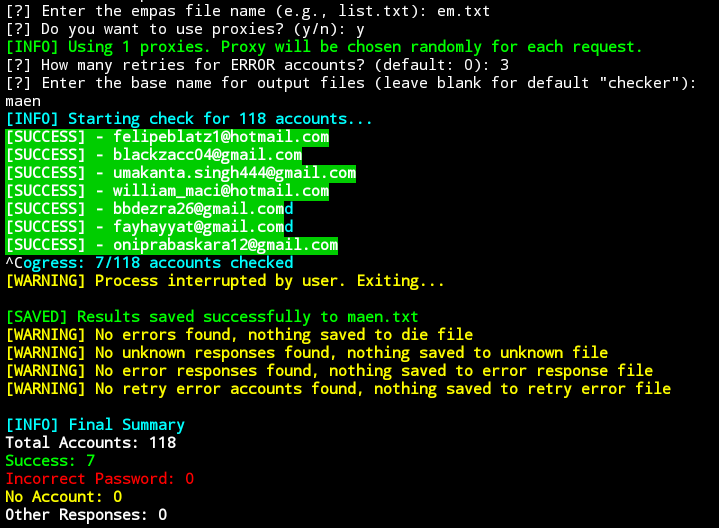

# Moonton Account Checker

A Python tool for verifying Moonton accounts.

## Features

- **Account Verification**: Checks if Moonton account credentials are valid.
- **Detailed Account Status**: Displays account statuses like successful login, incorrect password, or account not found.
- **Proxy Support**: Allows checking accounts using proxies.
- **Save Results**: Exports successful logins and other statuses to files.

## Installation

### Prerequisites
- **Python 3.8+**
- **Linux/Windows/Mac** (Note: Not tested on all platforms)

### Installation Steps
1. Clone this repository:
   ```bash
   git clone https://github.com/findme-19/Moonton-Checker
   ```
2. Navigate into the project directory:
   ```bash
   cd Moonton-Checker
   ```
3. Install the required Python packages:
   ```bash
   pip install -r requirements.txt
   ```

## Usage

1. **Prepare an Account List**: Create a file (e.g., `list.txt`) with accounts in the format `email:password` or `email|password`.  
   Example:
   ```
   user1@example.com:password1
   user2@example.com|password2
   ```

2. **Run the Script**:
   ```bash
   python main.py
   ```

3. **Input the License Key**: Upon starting, you will be prompted to enter a license key. Enter the valid key to proceed.

4. **Choose an Option**:
   - **1. Check Proxies**: Verify the functionality of proxies listed in a file.
   - **2. Run Checker**: Start checking the accounts from the provided list.
   - **3. Exit**: Exit the script.

5. **Additional Prompts for Account Checking**:
   - **Proxy Usage**: Choose whether to use proxies for checking accounts.
   - **Retry Attempts**: Specify the number of retries for accounts that return errors.
   - **Output File Name**: Define a base name for the output files.

## Example Output

```plaintext
Moonton Checker
Developed by: Findme-19

[SUCCESS] - user1@example.com
[WARNING] - Incorrect password for user2@example.com
[WARNING] - Account does not exist for user3@example.com

[INFO] Final Summary
Total Accounts: 100
[SUCCESS] Success: 30
[WARNING] Incorrect Password: 50
[WARNING] No Account: 15
[WARNING] Other Responses: 5
```

## Screenshots

### Start


---

### MENU


---

### PROXY


---
### END


## Notes
- Ensure that the license key is valid to access the tool.
- The tool is primarily designed for Linux, Windows, and Mac, but has not been tested on all platforms.
- Results are saved in text files for further analysis.
- Contact me on [Telegram](https://t.me/yangbenerwoy) to get license key
